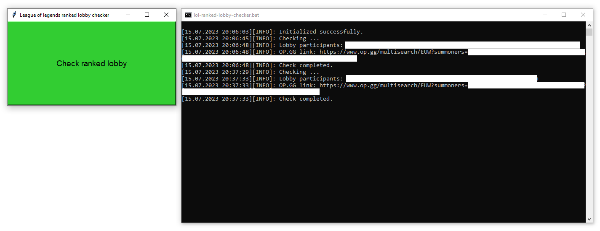

# What is this

League of legends ranked lobby participants checker / revealer / inspector. Running this program will open **a button and a console** for you to see the logs. Clicking the button will make the program try to communicate with league of legends client and if you are in a ranked lobby, it will gather information about all players and print an OP.GG link for the whole lobby into the console. This let's you decide whether those people are worth your time grinding ranked games.

- This is a scuffed ported solution of essential functionality, which was looked up from https://github.com/Riotphobia/LobbyReveal project. Ported in order to run an unbuilt and lightweight set of commands on a press of a button. In comparison to original, this version **does not** launch a constantly running `while` loop in the background, which polls the client with many requests.
- **Windows-only**

# Disclaimer

I do not take any responsibility of usage of this program by other individuals or companies for anything, including League of legends account bans. Use this at your own risk.

### Is this bannable?

Not sure, but potentially yes. On button press, the program makes a single HTTP request to a running league of legends client, using its exposed API endpoint, which was gathered through logs. I don't know if they use some internal logging and stricly look for the sequence and amount of HTTP requests. Realistically, they don't. And I would like to believe that making 1 more http request to the client per lobby should be totally fine.

# How to setup

- You need to have python3 installed (preferably version 3.11, which this was last tested with).
- Create a python virtual environment in project root by running `python -m venv venv`.
- Activate the newly created venv (you should see `(venv)` prefix in your terminal after activation) with `. venv/Scripts/activate`
- Install requirements into the launched venv from `requirements.txt` file by running `python -m pip install -r requirements.txt`
- Create `src/config.json` file by copying `src/config.template.json` file. Modify `src/config.json` according to your needs.

# How to run

**Make sure you are clicking the button when you have found a ranked match and are in a lobby with unknown people.**
## User-friendly

Run `bin/lol-ranked-lobby-checker.bat` (or `.ps1`) by double clicking it in Windows Explorer. Or right click the file and you should see a Run option in the context menu.

## Programmer-friendly

- Activate the venv (you should see `(venv)` prefix in your terminal after activation) with `. venv/Scripts/activate`
- Run the program with `python src/main.py`.

# Personal notes

- `requirements.txt` was generated with the help of globally installed `pipreqs` package.
  - Ran `pipreqs --encoding=utf8 .` in the project root while having venv **deactivated**.
